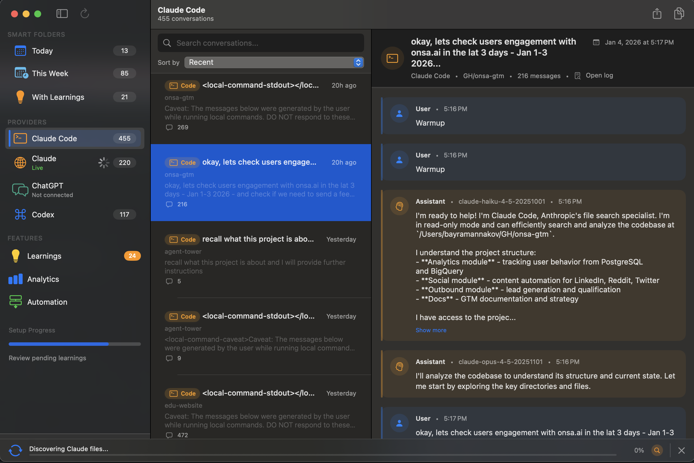
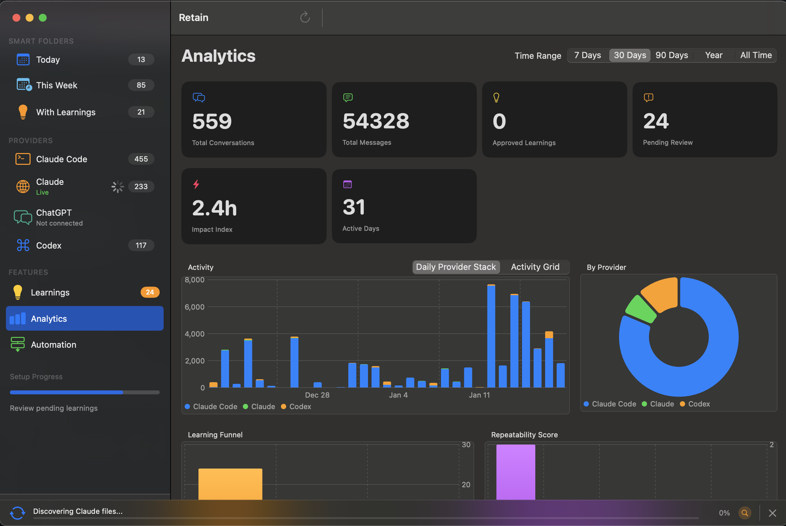

# Retain

[](../../releases)
[](../../releases)
[](LICENSE)

> A unified knowledge base for your AI conversations. Search, learn, and reflect across Claude Code, claude.ai, ChatGPT, and more.

<p align="center">
  
</p>

<p align="center">
  
</p>

From the creator of [claude-reflect](https://github.com/BayramAnnakov/claude-reflect) (300+ stars) - this is the evolution: a native macOS app that aggregates *all* your AI conversations, extracts learnings, and helps you build persistent context.

## What It Does

**The problem**: You use Claude Code, claude.ai, ChatGPT, and other AI tools daily. Context is scattered. When you discover a preference in one tool, you lose it in another. You keep re-explaining the same things.

**The solution**: Retain aggregates all your AI conversations into a single searchable knowledge base. It automatically extracts corrections and preferences, then exports them to `CLAUDE.md` so Claude remembers what you taught it.

### Key Features

- **Multi-source sync**: Auto-sync from Claude Code and Codex CLI (file watching), manual sync from claude.ai and ChatGPT (cookie-based)
- **Instant search**: Full-text search across 10k+ conversations with FTS5
- **Learning extraction**: Automatic detection of corrections ("no, use X instead") and preferences
- **CLAUDE.md export**: Export approved learnings so Claude remembers your preferences
- **Local-first**: All data stored locally. Optional cloud features (web sync, AI analysis) connect to external services when enabled.

## Beta Status

**Stable Features:**
- ✅ Conversation sync (Claude Code, Codex CLI, claude.ai, ChatGPT)
- ✅ Full-text search across all conversations
- ✅ Conversation browser and detail view
- ✅ Menu bar integration

**Work in Progress:**
- 🚧 **Learnings extraction** - functional but under active development
- 🚧 **Automations** - experimental, API may change significantly
- 🚧 **CLAUDE.md export** - works but formatting improvements planned

## Installation

### Requirements
- macOS 14.0 (Sonoma) or later
- For web sync: Safari, Chrome, or Firefox with active sessions

### Download

Download the latest **notarized DMG** (recommended) or zip from [Releases](https://github.com/BayramAnnakov/retain/releases).

### Install

DMG (recommended):
1. Open the DMG.
2. Drag Retain to Applications.
3. Launch Retain from Applications.

Zip (advanced):
1. Unzip and move Retain.app to Applications.
2. Launch Retain from Applications.

## Supported Sources

| Source | Type | Sync Method | Status |
|--------|------|-------------|--------|
| Claude Code | CLI | Auto (file watching) | ✅ Stable |
| Codex CLI | CLI | Auto (file watching) | ✅ Stable |
| claude.ai | Web | Cookie import from Safari/Chrome/Firefox | ✅ Works, sessions expire |
| chatgpt.com | Web | Cookie import from Safari/Chrome/Firefox | ✅ Works, sessions expire |

## Privacy & Security

**This is important. Please read.**

### What stays local
- All conversations are stored in a local SQLite database (`~/Library/Application Support/Retain/`)
- No data is sent to Retain servers (there are none)
- No telemetry, no analytics, no tracking

### What you should know

1. **Web sync reads browser cookies**: To sync from claude.ai/ChatGPT, the app reads session cookies from your browser. This requires Full Disk Access permission. The cookies are used only to authenticate API requests.

2. **Gemini integration (optional)**: If you enable AI features with Gemini:
   - Your API key is stored securely in the macOS Keychain
   - **Learning extraction**: Sends the last 10 messages (up to 500 chars each) to Google's Gemini API
   - **Workflow classification**: Sends conversation title, preview, and first message to categorize automation candidates
   - This feature is opt-in and disabled by default

3. **Claude Code CLI analysis (optional)**: If you enable CLI-based analysis:
   - Uses your local Claude Code CLI installation
   - Sends conversation data to Anthropic's API via the CLI
   - Requires consent in Settings before any data is sent
   - Codex CLI is disabled for security reasons (lacks hard no-tools flag)

4. **Web sessions expire**: claude.ai and ChatGPT sessions typically expire after ~30 days. You'll need to reconnect.

## Known Limitations (Beta)

This is beta software. Core features are stable, but expect some rough edges.

- **macOS only** - No Windows/Linux support planned for v1
- **Web sync is fragile** - Cookie-based auth can break if claude.ai/ChatGPT change their APIs
- **No import from exports** - Can't yet import JSON exports from ChatGPT/Claude settings
- **Web sessions expire** - claude.ai/ChatGPT cookie-based sessions require periodic reconnection
- **No conflict resolution** - If you sync from multiple Macs, conversations may duplicate

## Support

Best-effort. Please open an issue with clear reproduction steps and redacted logs.

## Building from Source

```bash
# Clone
git clone https://github.com/BayramAnnakov/retain.git
cd retain

# Build
swift build -c release

# Run
.build/release/Retain
```

## Roadmap

See [PHASED_VISION.md](docs/PHASED_VISION.md) for the long-term vision:

1. **Phase 1 (Current)**: Personal Memory OS - unified ingestion, learning extraction
2. **Phase 2**: Personal Automation - turn recurring workflows into playbooks
3. **Phase 3**: System of Record - versioning, governance, teams

## From claude-reflect

If you used [claude-reflect](https://github.com/BayramAnnakov/claude-reflect), Retain is its spiritual successor:

- claude-reflect: CLI tool that extracts learnings from Claude Code sessions
- Retain: Native app that does the same across *all* your AI tools with a proper UI

The learning extraction logic is similar, but Retain adds multi-source aggregation, search, and a native interface.

## Contributing

This is an early beta. The best way to contribute right now:

1. **Try it** and report bugs via [Issues](https://github.com/BayramAnnakov/retain/issues)
2. **Share feedback** on what sources you'd want next (Cursor? Aider? API logs?)
3. **Star the repo** if you find it useful

See [CONTRIBUTING.md](CONTRIBUTING.md) for dev setup and PR guidelines.

## Security & Privacy

- Security policy: [SECURITY.md](SECURITY.md)
- Privacy details: [PRIVACY.md](PRIVACY.md)

## License

MIT License - see [LICENSE](LICENSE) for details.

---

**Questions?** Open an issue or reach out on Twitter/X.
